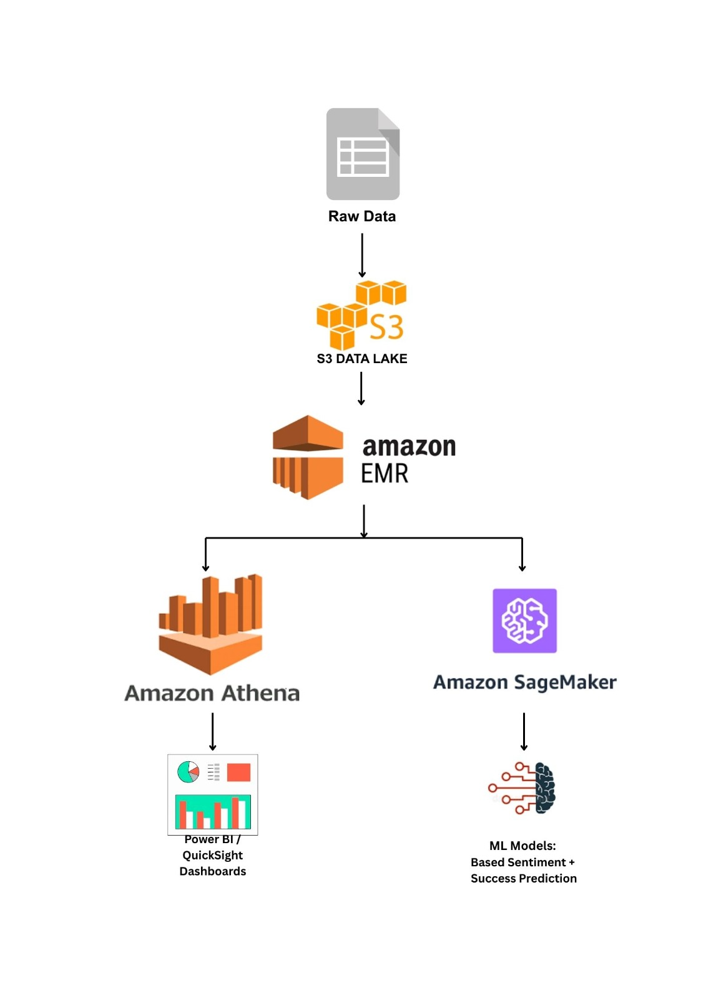

# 🎮 Steam Dataset 2025: Multi-Modal Gaming Analytics  
**Group 4 – Big Data Analytics Project**

---

## ❓ Problem Statement
Player engagement and review behavior on Steam are influenced by many factors, but the relationships between **game attributes**, **user sentiment**, and **market success** are not clearly understood.

This lack of insight makes it difficult for developers and publishers to:
- Identify drivers of positive sentiment
- Improve game visibility and traction
- Predict long-term success and community response

This project aims to bridge that gap using **big data analytics and machine learning**.

---

## 📂 Dataset
- **Dataset Name:** Steam Dataset 2025 – Multi-Modal Gaming Analytics  
- **Source:** Kaggle  
- **Link:**  
  https://www.kaggle.com/datasets/crainbramp/steam-dataset-2025-multi-modal-gaming-analytics

### Dataset Characteristics
- **239,664+ games**
- **1,000,000+ user reviews**
- **Multi-modal data**:
  - Structured metadata (games, genres, publishers, platforms)
  - Textual data (reviews, descriptions)
  - Vector embeddings (semantic search & ML)

---

## 🎯 Project Objectives
1. Transform Steam data into actionable insights by analyzing reviews and metadata.
2. Build a **scalable big-data pipeline** using cloud storage and Apache Spark.
3. Perform **sentiment analysis** to identify positive/negative trends and common issues.
4. Generate **business insights** on:
   - Game success
   - Developer & publisher performance
   - Genre popularity
   - Pricing strategies
5. Create **interactive dashboards (Power BI)** for visualization and reporting.
6. Develop **machine learning models** for:
   - Sentiment classification  
   - Success prediction  
   - Trend forecasting
7. Enable **automation and scalability** with scheduled ETL jobs and future enhancements.

---

## 🗂️ Data Dictionary (High-Level)

## 📘 Data Dictionary

This Data Dictionary provides a structured overview of the **Steam Dataset 2025** schema and serves as a reference for understanding tables, relationships, and key attributes used throughout the analytics pipeline.

---

### 🔹 Purpose
The data dictionary defines the structure, meaning, and data types of all major tables in the dataset. It enables:
- Consistent data interpretation  
- Easier analytics and ML development  
- Faster onboarding for new users of the dataset  

---

### 🔹 Dataset Scope
- **Total Games:** 239,664  
- **Total Reviews:** 1,048,148  
- **Schema Type:** Normalized relational model with JSON and embedding support  
- **Primary Use:** Big data analytics, sentiment analysis, and machine learning  

---

### 🔹 Core Tables

#### `applications`
Stores detailed metadata for each Steam application (games, DLCs, software).

| Column | Description |
|------|-------------|
| `appid` | Unique Steam application ID |
| `name` | Game or application name |
| `type` | Game, DLC, software, etc. |
| `is_free` | Free-to-play indicator |
| `release_date` | Official release date |
| `final_price` | Final price after discount |
| `metacritic_score` | Metacritic rating |
| `supports_windows / mac / linux` | Platform support flags |
| `description_embedding` | Vector embedding for semantic search |

---

#### `reviews`
Contains user-generated reviews and engagement metrics.

| Column | Description |
|------|-------------|
| `recommendationid` | Unique review ID |
| `appid` | Referenced application |
| `review_text` | Review content |
| `voted_up` | Positive or negative review |
| `votes_up` | Helpful votes |
| `votes_funny` | Funny votes |
| `weighted_vote_score` | Review helpfulness score |
| `review_embedding` | Text embedding for sentiment & similarity |

---

### 🔹 Lookup Tables

| Table | Description |
|------|-------------|
| `developers` | Unique game developers |
| `publishers` | Game publishers |
| `genres` | Game genres (Action, RPG, etc.) |
| `categories` | Steam feature categories |
| `platforms` | Supported OS platforms |

---

### 🔹 Relationship (Junction) Tables

| Table | Purpose |
|------|--------|
| `application_developers` | Links games to developers |
| `application_publishers` | Links games to publishers |
| `application_genres` | Links games to genres |
| `application_categories` | Links games to features |
| `application_platforms` | Links games to platforms |

These tables enable **many-to-many relationships** between applications and descriptive entities.

---

### 🔹 Embedding & ML Support

| Table | Description |
|------|-------------|
| `embedding_runs` | Tracks embedding generation metadata |
| `description_embedding` | Game-level semantic vector |
| `review_embedding` | Review-level semantic vector |

- Embedding dimension: **1024**
- Used for: sentiment analysis, semantic search, recommendations

---

### 🔹 Data Types Used
- `int64` – Identifiers and counts  
- `float64` – Prices, scores, metrics  
- `bool` – Flags (free-to-play, platform support)  
- `object / text` – Descriptions, reviews  
- `vector` – ML embeddings  

---

### 🔹 Usage Notes
- Foreign keys ensure referential integrity
- Preprocessed columns improve Spark and SQL performance
- Embeddings enable advanced NLP and similarity search
- Schema supports scalable analytics and ML workloads

---

This Data Dictionary should be used alongside the main `README.md` and analytics notebooks to ensure correct interpretation and usage of the dataset.

---

## 📊 Key Performance Indicators (KPIs)

### 1️⃣ Data Volume KPIs
- 239K+ Games collected  
- 1M+ User reviews processed  
- 13+ Normalized tables  

### 2️⃣ Data Quality KPIs
- 99% schema completeness  
- <1% missing fields in key tables  

### 3️⃣ Processing KPIs
- High-throughput API ingestion  
- Low ETL batch latency  
- Fast embedding generation  

### 4️⃣ Database Performance KPIs
- Metadata query latency < 100 ms  
- Vector search latency < 50 ms  
- Index hit rate > 90%  

### 5️⃣ Analytics KPIs
- 50+ genres analyzed  
- Platform coverage: Windows / macOS / Linux  
- Sentiment accuracy > 85%  

### 6️⃣ User Interaction KPIs
- Search response time < 200 ms  
- Recommendation similarity > 0.75  
- Positive vs negative sentiment tracking  

### 7️⃣ System Reliability KPIs
- 99% uptime  
- Pipeline failure rate < 1%  

---

## 🏗️ System Architecture (High-Level)

